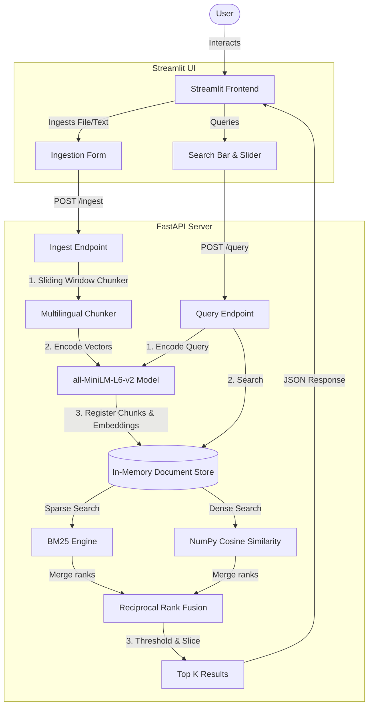

# ⚡ Advanced Hybrid RAG Engine

A production-grade, local, hybrid retrieval system combining **Dense Semantic Search** (vectors via transformer models) and **Sparse Lexical Search** (exact matching via BM25), fused together using **Reciprocal Rank Fusion (RRF)**. 

The application features a high-performance **FastAPI backend** (orchestrating model inference and vector mathematics) and a premium, responsive **Streamlit frontend dashboard** (supporting multi-format file uploads, PDF ingestion, raw text extraction, and granular search control).

---

## 🚀 Key Features

* **⚡ Zero-Cold-Start RRF**: Merges sparse and dense search results using Reciprocal Rank Fusion, with a low-confidence threshold filter ($0.018$) to eliminate noise.
* **📂 Hybrid Ingestion Console**: Supports uploading `.txt` and `.pdf` files (with automatic text extraction via `pypdf`) alongside raw text input.
* **🧠 High-Performance Local Embeddings**: Embeddings are generated using the `sentence-transformers/all-MiniLM-L6-v2` transformer model running locally on the CPU (wrapped in FastAPI's loop executors for non-blocking concurrent requests).
* **🔒 Thread-Safe InMemory Document Store**: Employs fine-grained concurrent locking for high-speed indexing and querying.

---

## 🏗️ Architecture Overview

The system architecture is structured as follows:



### 1. Ingestion Pipeline
* **File Upload / Extraction**: Supports `.txt` files directly and `.pdf` files parsed via `pypdf`.
* **Sliding Window Chunker**: Splits text into character-level sliding windows (default size `600` chars with an overlap of `200` chars) to preserve local context and remain language-agnostic (essential for multilingual support like CJK characters).
* **Dense Embedding Generation**: Runs `sentence-transformers/all-MiniLM-L6-v2` locally to output $384$-dimensional embeddings. The process runs asynchronously inside Python's executor thread pool to avoid blocking FastAPI's event loop.
* **Sparse Metadata Generation**: Tokenizes text and counts word frequencies to update the global collection and document frequency counters.

### 2. Retrieval Engine (`InMemoryDocumentStore`)
* **Thread Safety**: Reads and writes are guarded by a Python `threading.Lock` to support concurrent user sessions.
* **Sparse Search (BM25)**: Evaluates term importance based on local term frequency (TF) and inverse document frequency (IDF) with adjustments for average document length.
* **Dense Search**: Calculates Cosine Similarity between the query vector and all chunk vectors using high-performance vector operations via NumPy.
* **Reciprocal Rank Fusion (RRF)**: Merges sparse and dense ranking results. The RRF formula scoring a chunk $d$ is:
  $$RRF(d) = \sum_{m \in M} \frac{1}{60 + r_m(d)}$$
  where $M$ represents the search engines (lexical and vector), and $r_m(d)$ is the rank of chunk $d$ in engine $m$.
* **Trash/Garbage Thresholding**: Discards low-confidence results below a threshold ($0.018$) to prevent unrelated content from cluttering the context output.

---

## 🚦 How to Run the Application

Always execute commands from the **project root directory** (`/Users/pranjal/machine_learning/rag`).

### 1. Environment Activation
Activate your pre-configured local Python virtual environment:
```bash
source venv_py39/bin/activate
```

### 2. Launch the FastAPI Backend Engine
Start the high-performance retrieval engine on its designated port:
```bash
uvicorn backend:app --reload --port 8000
```
* **Host Gateway**: [http://localhost:8000](http://localhost:8000)
* **Architecture Note**: On the initial bootstrap, the engine safely streams and caches the `all-MiniLM-L6-v2` transformer architecture locally from Hugging Face. Subsequent initializations skip network overhead and load instantly from local disk storage.

### 3. Launch the Streamlit Frontend Dashboard
In a secondary terminal window (with the virtual environment activated), spin up the user interface layer:
```bash
streamlit run frontend.py --server.port 8501
```
* **UI Interface**: [http://localhost:8501](http://localhost:8501)
* **Hot-Reloading**: The Streamlit event loop natively monitors `frontend.py` state changes, dynamically rendering codebase updates in real-time without requiring manual service restarts.

---

## 🐳 Docker Deployment

The application is fully containerized and can be run in isolated environments.

1. **Build the Docker Image**:
   ```bash
   docker build -t hybrid-rag-app .
   ```

2. **Run the Container**:
   ```bash
   docker run -p 8000:8000 hybrid-rag-app
   ```
   *(Note: This executes the backend server. To run the frontend in Docker, adjust the port configurations and entrypoints accordingly).*

---

## 🛠️ Tech Stack & Key Dependencies

* **FastAPI**: Lightweight, asynchronous web framework for API development.
* **Streamlit**: Fast prototyping framework for building modern UI dashboard apps.
* **SentenceTransformers**: Python framework for state-of-the-art sentence, text, and image embeddings.
* **NumPy**: Linear algebra and vector operations for dense calculations.
* **pypdf**: Lightweight, zero-dependency PDF document parsing library.
