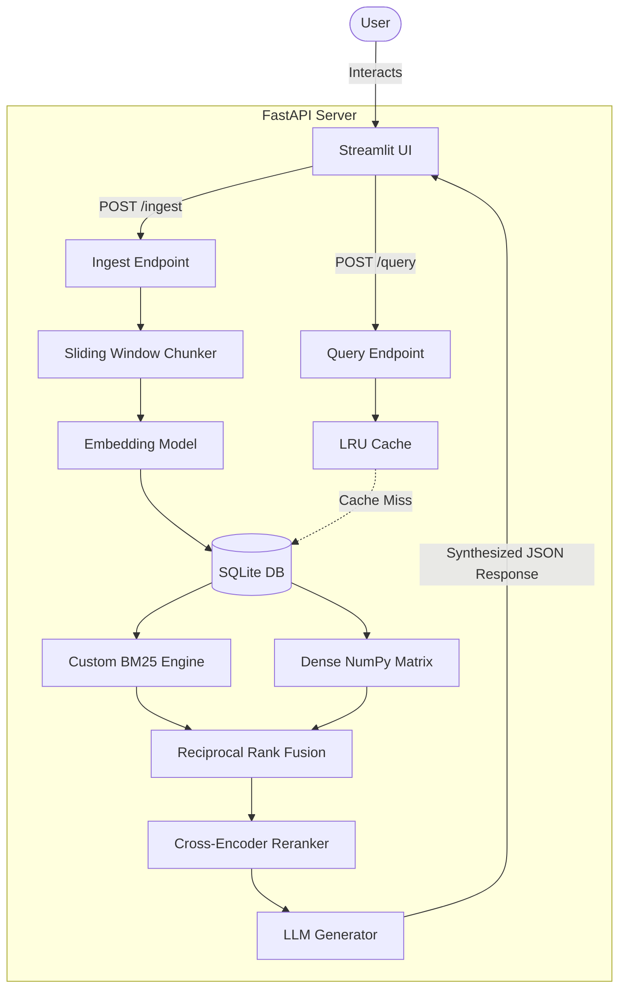

# ⚡ Advanced Hybrid RAG Engine

A production-grade hybrid retrieval and generation system combining **Dense Semantic Search** (vectors via transformer models) and **Sparse Lexical Search** (exact matching via BM25), fused together using **Reciprocal Rank Fusion (RRF)**, and refined with a **Cross-Encoder Reranker**. 

The application features a modular **FastAPI backend** (orchestrating model inference, vector mathematics, and LLM synthesis) and a premium, responsive **Streamlit frontend dashboard** (supporting multi-format file uploads, text extraction, and synthesized answers).

---

## 🚀 Key Features

* **⚡ Zero-Cold-Start RRF**: Merges sparse and dense search results using Reciprocal Rank Fusion, maximizing recall across both lexical and semantic boundaries.
* **🎯 Cross-Encoder Reranking**: Passes the top RRF candidates through a lightweight `ms-marco-MiniLM-L-6-v2` cross-encoder to precisely filter out irrelevant context.
* **🤖 LLM Synthesis**: Integrates external Generative AI (like Gemini 2.5 Flash) to synthesize human-readable answers directly from the strictly retrieved context.
* **📂 Hybrid Ingestion Console**: Supports uploading `.txt` and `.pdf` files alongside raw text input.
* **🧠 High-Performance Local Embeddings**: Embeddings are generated using the `all-MiniLM-L6-v2` transformer model locally (wrapped in FastAPI's loop executors for non-blocking concurrent requests).
* **🗄️ SQLite Persistence**: Uses a disk-backed SQLite datastore (`src/hybridrag/store/db.py`) for maintaining document and chunk states persistently.
* **⚡ Custom LRU Cache**: Implements a hand-written Hash Map + Doubly Linked List LRU cache to instantly return repeated identical queries.

---

## 🏗️ Architecture Overview

The system architecture is strictly modularized within the `src/hybridrag/` directory:


```mermaid
graph TD
    User([User]) -->|Interacts| Streamlit[Streamlit UI]
    
    subgraph Backend [FastAPI Server]
        Streamlit -->|POST /ingest| FastAPIIngest[Ingest Endpoint]
        Streamlit -->|POST /query| FastAPIQuery[Query Endpoint]
        
        FastAPIIngest --> Chunker[Sliding Window Chunker]
        Chunker --> Model[Embedding Model]
        Model --> Store[(SQLite DB)]
        
        FastAPIQuery --> LRU[LRU Cache]
        LRU -.->|Cache Miss| Store
        Store --> BM25[Custom BM25 Engine]
        Store --> Dense[Dense NumPy Matrix]
        BM25 --> RRF[Reciprocal Rank Fusion]
        Dense --> RRF
        RRF --> Reranker[Cross-Encoder Reranker]
        Reranker --> Generator[LLM Generator]
    end
    
    Generator -->|Synthesized JSON Response| Streamlit
```

---

## 🚦 How to Run the Application (Locally)

Always execute commands from the **project root directory**. You can easily spin up the entire application stack using Docker Compose.

### 1. Configure Secrets
Create a `.env` file in the root directory (make sure it's in `.gitignore`!) and add your API keys:
```bash
GEMINI_API_KEY=your_api_key_here
```

### 2. Launch via Docker Compose
```bash
docker-compose up --build
```
This will automatically:
1. Build the shared Python environment.
2. Spin up the FastAPI backend on `http://localhost:8000`.
3. Spin up the Streamlit frontend on `http://localhost:8501`.

---

## ☁️ Cloud Deployment (Render)

This repository includes a `render.yaml` Blueprint file for seamless 1-click deployments to Render.

1. Connect your GitHub repository to Render.
2. Select **Blueprint** and point it to this repo.
3. Render will instantly spin up `hybrid-rag-backend` and `hybrid-rag-frontend`.
4. Add your `GEMINI_API_KEY` to the Environment Variables of the backend service.
5. Provide the deployed backend URL to the frontend via the `RENDER_BACKEND_URL` variable.

---

## 🛠️ Testing & Benchmarks

The project includes an evaluation suite and latency benchmarks.
* **Run Unit Tests**: `pytest tests/`
* **Run Benchmarks**: `python benchmarks/latency_bench.py`

Continuous Integration (CI) is configured via GitHub Actions in `.github/workflows/ci.yml`.
